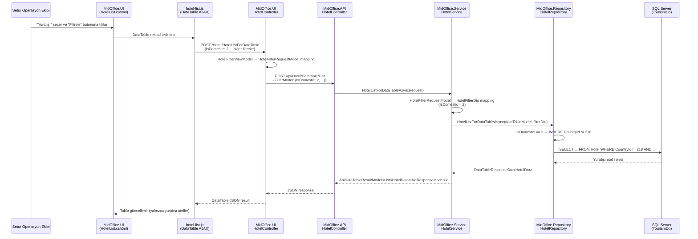

# PRD: CT-4211 — Otel MidOffice Listeleme Ekranında Yurtiçi/Yurtdışı Filtre Eklenmesi

> **Author**: Hotel PRD Agent
> **Date**: 9 Mart 2026
> **Status**: Draft
> **Jira**: CT-4211

---

## 1. Genel Bakış

MidOffice otel listeleme ekranına **Yurtiçi / Yurtdışı** filtresi eklenmesi. Şu anda Setur operasyon ekibi, yurtdışı lokal otelleri MidOffice arayüzünden filtreleyemiyor ve bu bilgiye ulaşmak için doğrudan veritabanı sorgusu yapmak zorunda kalıyor. Bu geliştirme ile `Hotel` tablosundaki `CountryId` alanı üzerinden oteller "Yurtiçi" (Türkiye, `CountryId = 218`) ve "Yurtdışı" (`CountryId ≠ 218`) olarak filtrelenebilecek.

---

## 2. Arka Plan ve Motivasyon

- **İş bağlamı**: Setur'un lokal otel portföyü hem yurtiçi hem yurtdışı otelleri kapsamaktadır. Operasyon ekibi otel yönetimi, fiyat planı kontrolü ve durum takibi için MidOffice ekranını kullanmaktadır.
- **Mevcut durum**: MidOffice otel listeleme ekranında kategori, otel durumu, şehir, ülke, bölge, kanal yöneticisi, sağlayıcı gibi filtreler bulunmaktadır. Ancak otelleri tek bir tıklamayla "yurtiçi" veya "yurtdışı" olarak ayırt edecek bir filtre mevcut değildir. Ülke filtresi var, ancak bu tek bir ülkeye göre filtreleme yapar — "Türkiye dışı tüm ülkeler" gibi ters bir gruplama desteklenmez.
- **Problem**: Operasyon ekibi, Setur'un yurtdışındaki lokal otellerini görmek istediğinde ya her ülkeyi tek tek seçmek ya da doğrudan DB'ye sorgu atmak zorunda kalıyor. Bu hem zaman kaybına hem de operasyonel riske yol açıyor.

---

## 3. Hedefler ve Kapsam Dışı

### Hedefler
1. MidOffice otel listeleme ekranına "Yurtiçi / Yurtdışı" dropdown filtresi eklemek.
2. Filtre değerlerine göre otel listesini sunucu tarafında (server-side) filtrelemek.
3. Varsayılan değer olarak "Tümü" seçeneğini getirmek (mevcut davranışı değiştirmemek).
4. Excel export fonksiyonunda da aynı filtrenin geçerli olmasını sağlamak.

### Kapsam Dışı
1. Yeni bir veritabanı tablosu veya kolon eklenmesi (mevcut `CountryId` alanı kullanılacak).
2. B2C veya B2E tarafında herhangi bir değişiklik.
3. Diğer sağlayıcı (Expedia, Tatilbudur, Akgunler) otellerinin filtrelenmesi — sadece Setur kontratı lokal oteller kapsama dahildir.
4. Ülke bazlı detaylı filtreleme (zaten mevcut Ülke filtresi bunu karşılıyor).
5. Feature flag implementasyonu.

---

## 4. Kullanıcı Hikayeleri ve Personalar

| Persona | Hikaye |
|---------|--------|
| Setur Operasyon Ekibi (B2E) | Bir operasyon uzmanı olarak, MidOffice'te otel listesini "Yurtiçi" veya "Yurtdışı" olarak filtrelemek istiyorum; böylece yurtdışı lokal otellerin yönetimini (fiyat planı kontrolü, durum güncelleme, vb.) veritabanına sorgu atmadan yapabileyim. |
| Setur Operasyon Ekibi (B2E) | Bir operasyon uzmanı olarak, filtrelediğim yurtiçi veya yurtdışı otel listesini Excel'e aktarabilmek istiyorum; böylece raporlama ihtiyaçlarımı karşılayabileyim. |

---

## 5. Fonksiyonel Gereksinimler

### FR-1: Yurtiçi/Yurtdışı Filtre Dropdown Bileşeni (UI)

- **Açıklama**: MidOffice otel listeleme sayfasına (`HotelList.cshtml`) yeni bir dropdown filtre eklenmesi. Dropdown üç seçenek içerecek: **Tümü**, **Yurtiçi**, **Yurtdışı**.
- **Etkilenen Servisler**: `tourism-beyond-midoffice` (MidOffice.UI projesi)
- **Kabul Kriterleri**:
  - [ ] `HotelList.cshtml` görünümünde mevcut filtre alanları arasına (Ülke filtresinin yakınına) "Yurtiçi/Yurtdışı" label'ı ile bir `<select>` dropdown eklenir.
  - [ ] Dropdown seçenekleri: `Tümü` (varsayılan, value: `null`), `Yurtiçi` (value: `1`), `Yurtdışı` (value: `2`).
  - [ ] Sayfa ilk yüklendiğinde varsayılan olarak "Tümü" seçili gelir.
  - [ ] `hotel-list.js` dosyasındaki DataTable AJAX çağrısına `IsDomestic` parametresi eklenir ve dropdown değeri gönderilir.

### FR-2: Filter View Model Güncellemesi (UI)

- **Açıklama**: `HotelFilterViewModel` sınıfına yeni filtre alanının eklenmesi ve Controller'da mapping yapılması.
- **Etkilenen Servisler**: `tourism-beyond-midoffice` (MidOffice.UI projesi)
- **Kabul Kriterleri**:
  - [ ] `HotelFilterViewModel` sınıfına `int? IsDomestic` property eklenir.
  - [ ] `HotelFilterViewModel` sınıfına `List<SelectListItem> IsDomesticList` property eklenir (dropdown seçenekleri için).
  - [ ] `HotelController.HotelList()` (GET — sayfa yükleme) action'ında `IsDomesticList` doldurulur (Tümü / Yurtiçi / Yurtdışı).
  - [ ] `HotelController.HotelListForDataTable()` action'ında `IsDomestic` değeri alınıp `HotelFilterRequestModel`'e aktarılır.

### FR-3: API Request/Response Model Güncellemesi

- **Açıklama**: MidOffice API'nin `HotelFilterRequestModel` sınıfına yeni filtre parametresinin eklenmesi.
- **Etkilenen Servisler**: `tourism-beyond-midoffice` (MidOffice.Api.RequestModel projesi)
- **Kabul Kriterleri**:
  - [ ] `HotelFilterRequestModel` sınıfına `int? IsDomestic` property eklenir.
  - [ ] Mevcut API kontratı geriye dönük uyumlu kalır (property nullable olduğu için `null` = filtre uygulanmaz = mevcut davranış korunur).

### FR-4: Domain DTO Güncellemesi

- **Açıklama**: `HotelFilterDto` sınıfına yeni filtre alanının eklenmesi.
- **Etkilenen Servisler**: `tourism-beyond-midoffice` (MidOffice.Domain projesi)
- **Kabul Kriterleri**:
  - [ ] `HotelFilterDto` sınıfına `int? IsDomestic` property eklenir.
  - [ ] `HotelService.HotelListForDataTableAsync()` metodunda `IsDomestic` değeri `HotelFilterRequestModel`'den `HotelFilterDto`'ya aktarılır.

### FR-5: Repository Sorgusuna Filtre Eklenmesi (Backend)

- **Açıklama**: `HotelRepository.HotelListForDataTableAsync()` metodundaki EF Core LINQ sorgusuna `IsDomestic` filtre koşulunun eklenmesi.
- **Etkilenen Servisler**: `tourism-beyond-midoffice` (MidOffice.Repository projesi)
- **Kabul Kriterleri**:
  - [ ] `IsDomestic == 1` (Yurtiçi) seçildiğinde: `query = query.Where(t => t.CountryId == 218)` filtresi uygulanır.
  - [ ] `IsDomestic == 2` (Yurtdışı) seçildiğinde: `query = query.Where(t => t.CountryId != 218)` filtresi uygulanır.
  - [ ] `IsDomestic == null` (Tümü) seçildiğinde: herhangi bir filtre uygulanmaz (mevcut davranış).
  - [ ] Türkiye `CountryId = 218` sabit değeri, proje genelinde kullanılan `DBCountryEnum.Turkey` enum'u üzerinden referans alınır (magic number kullanılmaz).

### FR-6: Excel Export Desteği

- **Açıklama**: `SaveHotelListToExcelFile()` metodunda Yurtiçi/Yurtdışı filtresinin de gönderilmesi.
- **Etkilenen Servisler**: `tourism-beyond-midoffice` (MidOffice.UI projesi)
- **Kabul Kriterleri**:
  - [ ] `SaveHotelListToExcelFile()` metodu `IsDomestic` filtre parametresini alır ve `HotelFilterRequestModel`'e aktarır.
  - [ ] Kullanıcı "Yurtdışı" filtresini seçip Excel export yaptığında, yalnızca yurtdışı oteller dosyada yer alır.

---

## 6. Fonksiyonel Olmayan Gereksinimler

| Kategori | Gereksinim | Hedef |
|----------|-------------|-------|
| Performans | Yeni filtre mevcut sorgu süresini anlamlı ölçüde artırmamalı | `CountryId` zaten indeksli bir FK olduğundan ek performans etkisi minimal olmalı |
| Geriye Dönük Uyumluluk | Mevcut API kontratı bozulmamalı | `IsDomestic` nullable olduğu için `null` gönderildiğinde mevcut davranış korunur |
| Kullanılabilirlik | Filtre diğer filtrelerle birlikte çalışabilmeli | Yurtiçi/Yurtdışı filtresi mevcut Ülke, Şehir, Bölge filtreleriyle birlikte uygulanabilir |
| Güvenlik | Filtre değeri validasyonu | Sadece `null`, `1`, `2` değerleri kabul edilmeli |
| Gözlemlenebilirlik | Mevcut loglama altyapısı yeterli | Ek loglama gerekmiyor — mevcut request/response loglama filtreyi de kapsayacak |

---

## 7. Sistem Tasarımı Genel Bakış

### 7.1 Etkilenen Servisler

| Servis | Repository | Değişiklik Tipi | Özet |
|---------|-----------|-------------|---------|
| MidOffice UI | `tourism-beyond-midoffice` (MidOffice.UI) | Değişiklik | Razor view'a dropdown eklenmesi, JS AJAX güncelleme, ViewModel ve Controller güncelleme |
| MidOffice API | `tourism-beyond-midoffice` (MidOffice.API) | Değişiklik | Controller action'da parametre geçişi (mevcut kodu otomatik olarak karşılar) |
| MidOffice Service | `tourism-beyond-midoffice` (MidOffice.Service) | Değişiklik | `HotelListForDataTableAsync` servis metodu DTO mapping güncellemesi |
| MidOffice Repository | `tourism-beyond-midoffice` (MidOffice.Repository) | Değişiklik | `HotelListForDataTableAsync` EF Core LINQ sorgusuna WHERE koşulu eklenmesi |
| MidOffice Domain | `tourism-beyond-midoffice` (MidOffice.Domain) | Değişiklik | `HotelFilterDto`'ya `IsDomestic` property eklenmesi |
| MidOffice RequestModel | `tourism-beyond-midoffice` (MidOffice.Api.RequestModel) | Değişiklik | `HotelFilterRequestModel`'e `IsDomestic` property eklenmesi |

### 7.2 Veri Akışı

### 7.3 API Değişiklikleri

- **Servis**: MidOffice API
- **Endpoint**: `POST api/Hotel/Datatable/Get`
- **Request Model Değişikliği**:
  | Alan | Tip | Açıklama |
  |------|-----|----------|
  | `IsDomestic` | `int?` | `null` = Tümü, `1` = Yurtiçi (CountryId == 218), `2` = Yurtdışı (CountryId != 218) |
- **Response Model**: Değişiklik yok
- **Breaking Change**: Hayır (nullable property — gönderilmezse mevcut davranış korunur)

### 7.4 Veri Modeli Değişiklikleri

- **Veritabanı**: Değişiklik yok
- **Tablo**: Değişiklik yok — mevcut `Hotel.CountryId` FK alanı kullanılacak (`CountryId = 218` → Türkiye)
- **Migrasyon**: Gerekli değil

### 7.5 Event / Mesaj Değişiklikleri

Yok — bu değişiklik yalnızca MidOffice'in kendi iç katmanları arasında veri akışını etkiler. Azure Service Bus veya MassTransit seviyesinde herhangi bir değişiklik gerektirmez.

### 7.6 Cache Etkisi

Yok — MidOffice otel listeleme ekranı server-side DataTable ile çalışır ve her istekte doğrudan DB sorgusu yapılır (cache katmanı yoktur).

---

## 8. Kenar Durumlar ve Hata Yönetimi

| Senaryo | Beklenen Davranış |
|----------|-------------------|
| `IsDomestic = null` gönderildiğinde | Mevcut davranış korunur — tüm oteller listelenir |
| `IsDomestic` ile birlikte Ülke filtresi de seçildiğinde | Her iki filtre AND ile uygulanır. Örnek: `IsDomestic = 2` + `CountryId = 5` → sadece CountryId=5 olan oteller gelir (geçerli kombinasyon) |
| `IsDomestic = 1` (Yurtiçi) + Ülke filtresi farklı bir ülke seçildiğinde | AND ile uygulanır → sonuç boş gelir (CountryId=218 AND CountryId=X → boş küme). Bu beklenen davranıştır. |
| Geçersiz `IsDomestic` değeri gönderildiğinde (ör. `3`) | Filtre uygulanmaz — `null` gibi davranır (savunmacı kodlama) |
| Otel tablosunda `CountryId = NULL` olan kayıtlar varsa | Bu oteller "Yurtdışı" sonuçlarına dahil edilir (`CountryId != 218` → NULL != 218 → true). Alternatif olarak bu oteller her iki filtrede de gösterilmeyebilir — implementasyon sırasında davranış netleştirilmelidir. |
| Excel export ile birlikte kullanım | Filtre Excel export fonksiyonuna da aktarılır — yalnızca filtrelenmiş oteller export edilir |

---

## 9. Bağımlılıklar ve Riskler

| Bağımlılık/Risk | Etki | Azaltma |
|-----------------|--------|------------|
| `CountryId = 218` sabit değeri Türkiye'yi temsil eder | Eğer bu değer değişirse filtre yanlış çalışır | `DBCountryEnum.Turkey` enum'u kullanılarak referans alınmalı — magic number kullanılmamalı |
| MidOffice UI ve API aynı repo'da (`tourism-beyond-midoffice`) | Deployment tek seferde yapılacak | UI ve API aynı anda deploy edilmeli, ara durumda versyon uyumsuzluğu olmaz |
| `Hotel.CountryId` alanında NULL değer olabilir | NULL CountryId'li oteller filtreleme sonuçlarını etkileyebilir | Repository sorgusunda NULL kontrolü eklenmeli |

---

## 10. Test Stratejisi

| Test Tipi | Kapsam | Açıklama |
|-----------|-------|-------------|
| Unit | `HotelRepository.HotelListForDataTableAsync` | `IsDomestic = 1` → yalnızca `CountryId == 218` olan oteller döner; `IsDomestic = 2` → `CountryId != 218`; `IsDomestic = null` → tüm oteller |
| Unit | `HotelService.HotelListForDataTableAsync` | DTO mapping'te `IsDomestic` alanının doğru aktarıldığının doğrulanması |
| Integration | API endpoint `POST api/Hotel/Datatable/Get` | `IsDomestic` parametresi ile çağrıldığında doğru filtrelenmiş sonuçların dönmesi |
| UI/Manuel | MidOffice otel listeleme sayfası | Dropdown'dan "Yurtiçi" seçildiğinde sadece Türkiye otelleri; "Yurtdışı" seçildiğinde sadece yurtdışı oteller; "Tümü" seçildiğinde tüm oteller listelenmeli |
| UI/Manuel | Excel export | Filtre aktif iken export yapıldığında yalnızca filtrelenmiş otellerin dosyada yer aldığının doğrulanması |
| Regression | Mevcut filtreler | Yeni filtre ekledikten sonra mevcut filtrelerin (kategori, durum, şehir, ülke, vb.) hâlâ doğru çalıştığının doğrulanması |

---

## 11. Rollout Planı

- **Feature flag**: Gerekli değil — düşük riskli, geriye dönük uyumlu değişiklik.
- **Rollout aşamaları**:
  1. `development` branch'ine merge
  2. Testing ortamında doğrulama
  3. Staging/Preprod ortamında QA testi
  4. Production deploy
- **Geri alma planı**: Değişiklik geriye dönük uyumlu olduğundan, yeni filtre kullanılmazsa (`IsDomestic = null`) mevcut davranış korunur. Acil durumda önceki sürüme rollback yapılabilir.

---

## 12. Açık Sorular

- [ ] `Hotel` tablosunda `CountryId = NULL` olan kayıtlar var mı? Varsa bu oteller "Yurtdışı" filtresinde mi gösterilmeli, yoksa her iki filtrede de hariç mı tutulmalı?
- [ ] "Yurtiçi/Yurtdışı" filtresi ile "Ülke" filtresinin aynı anda kullanımı durumunda kullanıcıya bir uyarı/kısıtlama gösterilmeli mi, yoksa AND ile birlikte çalışması yeterli mi?
- [ ] Türkiye `CountryId = 218` değeri `DBCountryEnum.Turkey` enum'unda zaten tanımlı mı? (Araştırmada referans bulundu, ancak enum tanımının tam konumu doğrulanmalı.)
