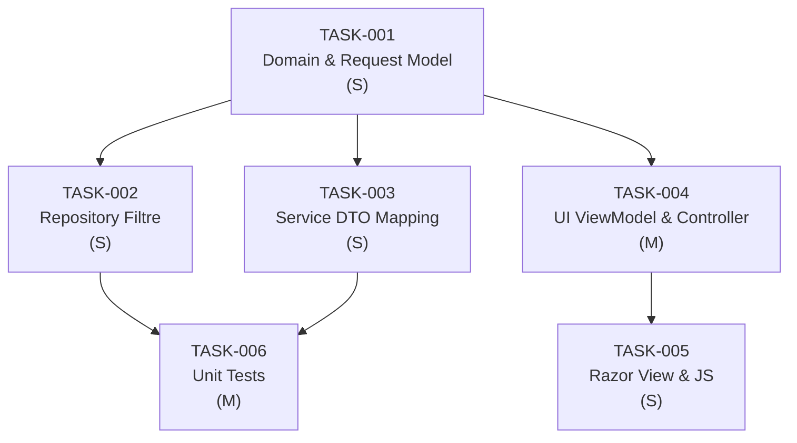

# Implementation Plan: CT-4211 — Otel MidOffice Listeleme Ekranında Yurtiçi/Yurtdışı Filtre Eklenmesi

> **PRD**: CT-4211/PRD-CT-4211.md
> **Date**: 9 Mart 2026
> **Total Tasks**: 6
> **Affected Projects**: tourism-beyond-midoffice

## FR → Task Mapping

| FR | Açıklama | Task'lar |
|----|----------|----------|
| FR-1 | Yurtiçi/Yurtdışı Filtre Dropdown Bileşeni (UI) | TASK-005 |
| FR-2 | Filter View Model Güncellemesi (UI) | TASK-004 |
| FR-3 | API Request Model Güncellemesi | TASK-001 |
| FR-4 | Domain DTO Güncellemesi | TASK-001, TASK-003 |
| FR-5 | Repository Sorgusuna Filtre Eklenmesi (Backend) | TASK-002 |
| FR-6 | Excel Export Desteği | TASK-004 |

## Dependency Graph

## Execution Order

1. **TASK-001** — Domain ve API Request Model'e IsDomestic Alanı Eklenmesi (tourism-beyond-midoffice) — Bağımlılık yok
2. **TASK-002** — Repository Katmanına IsDomestic Filtre Koşulu Eklenmesi (tourism-beyond-midoffice) — TASK-001'e bağımlı
3. **TASK-003** — Service Katmanında IsDomestic DTO Mapping Güncellemesi (tourism-beyond-midoffice) — TASK-001'e bağımlı
4. **TASK-004** — UI ViewModel ve Controller Güncellemesi (tourism-beyond-midoffice) — TASK-001'e bağımlı
5. **TASK-005** — Razor View ve JavaScript Güncellemesi (tourism-beyond-midoffice) — TASK-004'e bağımlı
6. **TASK-006** — Unit Test — IsDomestic Filtresi (tourism-beyond-midoffice) — TASK-002, TASK-003'e bağımlı

> **Not**: TASK-002, TASK-003 ve TASK-004 birbirinden bağımsızdır ve TASK-001 tamamlandıktan sonra paralel olarak geliştirilebilir.

## Cross-Project Dependencies

| From | To | Detail |
|------|----|--------|
| — | — | Yok — tek proje değişikliği (tourism-beyond-midoffice) |
