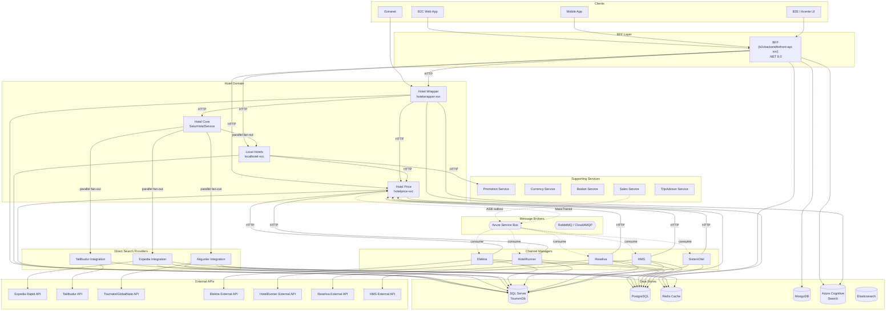
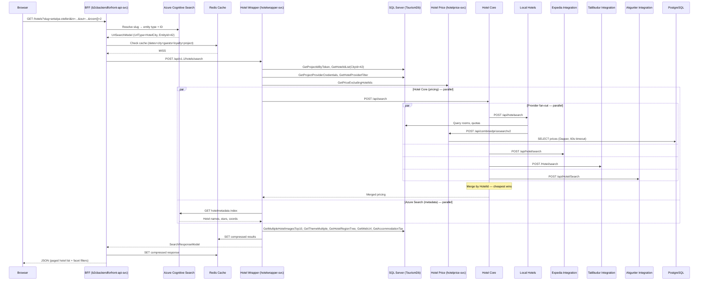
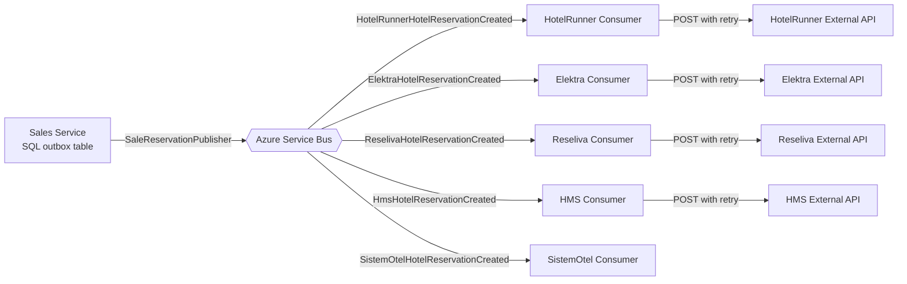
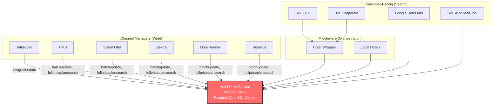

# Setur Tourism — Hotel Team Architecture Reference

> **Generated**: March 7, 2026
> **Purpose**: Agent-consumable architecture reference for AI-assisted task decomposition from stakeholder requests
> **Scope**: Hotel domain services within the Setur Tourism Beyond platform
> **Azure DevOps Project**: SeturTourism (`seturcloud.visualstudio.com`)

---

## Table of Contents

1. [Platform Overview](#1-platform-overview)
2. [High-Level Architecture Diagram](#2-high-level-architecture-diagram)
3. [Hotel Domain Services](#3-hotel-domain-services)
4. [Hotel Search — End-to-End Flow](#4-hotel-search--end-to-end-flow)
5. [Hotel Booking & Reservation Flow](#5-hotel-booking--reservation-flow)
6. [Event-Driven Architecture](#6-event-driven-architecture)
7. [Data Stores](#7-data-stores)
8. [Cross-Service Dependencies](#8-cross-service-dependencies)
9. [External Systems](#9-external-systems)
10. [Service Inventory](#10-service-inventory)
11. [Known Pain Points & Technical Debt](#11-known-pain-points--technical-debt)

---

## 1. Platform Overview

Setur Tourism Beyond is a **microservices-based travel booking platform** running on **Kubernetes** (`.production.setur.k8s` cluster). The overall platform handles hotels, flights, tours, transfers, and packages. This document focuses on the **Hotel domain** — the services owned and maintained by the Hotel team.

| Aspect | Choice |
|---|---|
| **Architecture** | Microservices with BFF (Backend for Frontend) pattern |
| **Communication** | Synchronous HTTP (primary) + Asynchronous Azure Service Bus / RabbitMQ (events) |
| **API Gateway** | BFF acts as gateway for all B2C/Mobile clients |
| **Service Discovery** | Kubernetes internal DNS (`{service}-svc.{env}.setur.k8s`) |
| **Authentication** | OpenID Connect / JWT via Identity Server (`dsso.setur.com.tr`) |
| **Observability** | Elastic APM + Elasticsearch logging |
| **Secrets** | Azure Key Vault (ClientSecretCredential / DefaultAzureCredential) |
| **Container Runtime** | Docker images deployed via Helm charts to K8s |
| **Source Control** | **MultiRepo** — every service has its own Git repository in Azure DevOps |

---

## 2. High-Level Architecture Diagram



---

## 3. Hotel Domain Services

### 3.1 Hotel Wrapper (`tourism-beyond-hotel-wrapper`)

| Attribute | Value |
|---|---|
| **K8s Service** | `hotelwrapper-svc` |
| **Role** | Search orchestrator — aggregates hotel data from Core, Price, metadata, and SQL |
| **Runtime** | .NET 8.0, ASP.NET Core |
| **ORM** | Dapper (raw SQL via `HotelQueries.cs`, 50+ query methods in `HotelRepository`) |
| **Database** | SQL Server (`TourismDbConnectionString`) |
| **Cache** | Azure Redis Cache (instance prefix: `HotelWrapper:`) + `IDistributedCache` |
| **Search** | Azure Cognitive Search (index: `hotelmetadata`) |
| **Message Broker** | MassTransit + Azure Service Bus (`HotelMetaDataCached` consumer in background worker) |
| **Architecture** | Clean Architecture: Core → Application → Infrastructure → Presentation |

**API Endpoints (V1.1 — Current):**

| Method | Path | Action |
|---|---|---|
| POST | `api/v1.1/hotels/search` | Main dated/dateless hotel search |
| POST | `api/v1.1/hotels/searchwithrooms` | Search with room detail |
| POST | `api/v1.1/hotels/externalsearch` | External search (B2E) |
| POST | `api/v1.1/hotels/lowestpricesearch` | Lowest price per hotel |
| POST | `api/v1.1/hotels/smallsearch` | Lightweight search |

**Deployable Artifacts:**
1. `HotelWrapperService.API` — Main Web API
2. `HotelWrapperService.HotelMetaDataCaching` — Background Worker (WebJob) that consumes `HotelMetaDataCached` messages and warms Redis cache

**Upstream Callers (6+):**
- `tourism-beyond-backendforfrontend` (B2C BFF)
- `tourism-beyond-basket` (Basket Service)
- `tourism-beyond-extranet-service` (Extranet)
- `tourism-beyond-hotel-remarketing` (Remarketing)
- `tourism-beyond-integrations-trivago` (Trivago feed)
- `tourism-beyond-channel-manager-integration` (Channel Manager)

**Downstream Dependencies (9):**

| Service | Config Key | Purpose |
|---|---|---|
| Hotel Core | `SeturHotelServiceUrl` | Pricing/availability from providers |
| Hotel Price | `HotelPriceServiceUrl` | Price exclusion lists, lowest price |
| TatilBudur | `TatilBudurServiceUrl` | TatilBudur integration |
| Basket API | `BasketApiUrl` | Basket operations |
| Expedia | `ExpediaServiceUrl` | Content/reviews/ratings |
| Currency | `CurrencyServiceUrl` | Currency conversion |
| TripAdvisor | `TripAdvisorServiceUrl` | Reviews/ratings |
| Azure Cognitive Search | `AzureSearchUrl` | Hotel metadata index |
| Azure Service Bus | `ServiceBusSharedAccess` | Event bus |

**Multi-Project Token Support:**
The wrapper supports multiple sales channels: `B2CProjectToken`, `SeturBizProjectToken`, `SeturBizMobilProjectToken`, `AcenteProjectToken`, `WestProjectToken`.

---

### 3.2 Hotel Core (`tourism-beyond-hotel-core`)

| Attribute | Value |
|---|---|
| **Role** | Core hotel business logic + provider fan-out factory |
| **Pattern** | Receives search request from Wrapper, fans out to 4 providers **in parallel**, merges results (cheapest wins per hotel) |

**Provider Fan-Out:**
```
Hotel Core receives POST /api/search
  ├── SeturLocalHotel  → POST localhotel-svc/api/hotelsearch
  ├── Expedia          → POST expedia-svc/api/hotel/search
  ├── Tatilbudur       → POST tatilbudur-svc/Hotel/search
  └── Akgunler         → POST akgunler-svc/api/Hotel/Search
```

After all providers respond, Hotel Core merges results by `HotelId` — cheapest provider wins per hotel.

---

### 3.3 Hotel Price (`tourism-beyond-hotel-price`)

| Attribute | Value |
|---|---|
| **K8s Service** | `hotelprice-svc` |
| **Role** | Centralized price management and query engine — **one of the highest fan-in services** (10+ callers) |
| **Runtime** | .NET 8.0 |
| **ORM** | Dapper 2.1.44 + Dapper.Contrib |
| **Primary DB** | PostgreSQL (Npgsql 8.0.3) — all price CRUD |
| **Secondary DB** | SQL Server — quota logs, project lookups |
| **Message Broker** | MassTransit 8.3.6–8.5.2 + Azure Service Bus |
| **Caching** | **NONE** — No Redis, no MemoryCache (known critical gap) |
| **Testing** | xUnit 2.5.3, Moq 4.20.72, Moq.Dapper 1.0.7 |

**Solution Structure (16 projects, Clean Architecture):**
```
src/Core/     → Domain, Application (business logic, MassTransit consumers), Shared, SharedModels
src/Infra/    → Persistence (Dapper, ConnectionFactory), CurrencyService, EmailService, PromotionService, ServiceBusService
src/Present/  → API (net8.0), PeriodListJob (WebJob), PromotionPriceChangeJob (WebJob + MassTransit)
src/Migrated/ → SeturHotelPriceApi.Models (NuGet v2.0.2, netstandard2.0/2.1)
tests/        → xUnit + Moq + Moq.Dapper
```

**API Endpoints (18 — all POST):**

| Category | Endpoint | Purpose |
|---|---|---|
| **Search** | `api/combinedpricesearchv2` | Primary price search (hot path for B2C/B2E availability) |
| **Search** | `api/fullpriceplansearch` | Full price plan data for a single project |
| **Search** | `api/fullpriceplansearchmultiple` | Multi-project price plan search |
| **Search** | `api/lowestpriceofhotellist` | Lowest price per hotel (currency conversion, seasonal fallback) |
| **Search** | `api/futurepriceinfosearch` | Calendar view pricing |
| **Write** | `api/batchupdate` | Primary batch update (chunks 30 days, Task.WhenAll) |
| **Write** | `api/batchpriceupdate` | Price-specific batch (Parallel.ForEach + ConcurrentBag) |
| **Write** | `api/batchrangeupdate` | Date-range batch update |
| **Write** | `api/batchpriceupdatecheck` | Pre-flight validation |
| **Write** | `api/batchrangeupdatecheck` | Pre-flight validation |
| **Manage** | `api/copypricedata` | Copy price data between plans |
| **Manage** | `api/deleteplans` | Delete price plans |
| **Integration** | `api/integrationdata` | Price data for channel manager integrations |
| **Integration** | `api/HotelPriceList` | Hotel price list |
| **Integration** | `api/hotelpriceperiod` | Price plan periods |
| **Log** | `api/GetChangedPricePlanList` | Change logs v1 |
| **Log** | `api/GetChangedPricePlanListV2` | Change logs v2 |
| **Log** | `api/AddHotelExternalPriceQuotaLogsToQueue` | Enqueue external change events |

**Dual-Database Architecture:**
```
Hotel Price API → ConnectionFactory
  ├── PgPriceDbConnectionString → PostgreSQL (price CRUD, parameterized SQL via PriceQueries class)
  └── TourismDbConnectionString → SQL Server (quota logs, project lookups)
```

**MassTransit Consumers:**

| Queue | Consumer | Retry | Concurrency |
|---|---|---|---|
| `{HotelPriceQuotaChanged}` | `HotelPriceQuotaChangedConsumer` | Incremental(5, 5s) | Default |
| `{PromotionPriceChanged}` | `PromotionPriceChangedConsumer` | Incremental(5, 5s) | 1 (sequential) |
| `{PromotionPriceChanged}-scheduled` | `PromotionPriceChangedConsumer` | Interval(3, 10s) | 1 (sequential) |

**Callers (10+ upstream repos):**

| Caller | Endpoints Used |
|---|---|
| Hotel Wrapper | `combinedpricesearchv2`, `lowestpriceofhotellist` |
| Local Hotels | `combinedpricesearchv2`, `FullPricePlanSearch`, `AddHotelExternalPriceQuotaLogsToQueue` |
| HMS, SistemOtel, Elektra, HotelRunner, Reseliva | `batchupdate`, `fullpriceplansearch` |
| Tatilsepeti | `integrationdata` |
| Google Hotel Ads | Price search endpoints |
| B2C BFF, B2E | Search endpoints (via Wrapper or direct) |
| B2E Auto Mail Job | Price queries |

**Thread Pool Tuning:**

| Setting | Production | Non-Production |
|---|---|---|
| `DefaultConnectionLimit` | 500 | 100 |
| `ThreadPool.SetMinThreads` (worker + IO) | 250 | 50 |
| Nagle Algorithm | Disabled | Disabled |

---

### 3.4 Local Hotels (`tourism-beyond-hotel-locals`)

| Attribute | Value |
|---|---|
| **K8s Service** | `localhotel-svc` |
| **Role** | Local/domestic hotel inventory — search, prebook, confirm, cancel |
| **Database** | SQL Server (`TourismDbConnectionString`) via Dapper |

**Key Endpoints:**

| Route | Purpose |
|---|---|
| `POST api/hotelsearch` | Main hotel search |
| `POST api/hotelsearchwithrooms` | Search with room details |
| `POST api/gethotelrooms` | Room details |
| `POST api/prebook` | Pre-booking check |
| `POST api/confirm` | Confirm reservation |
| `POST api/cancel` | Cancel reservation |
| `POST api/check-availability` | Availability check |

**Downstream Dependencies:**
- Hotel Price Service → `combinedpricesearchv2`, `FullPricePlanSearch`
- Promotion Service → `api/hotelactions/getallByHotelIdList`
- Currency Service, B2E Service, Setur Mail Service

**Key Config:** `CanBeSoldWithoutQuotas`, `AccommodationTaxPercent`, `LowQuotaLimit`, SQL batch size: 2000

---

### 3.5 Channel Managers (Inventory Sync + Reservation Push)

All channel managers share a common endpoint pattern and serve two purposes:
1. **Inventory sync** — External channel managers push room/price/quota updates to Setur
2. **Reservation push** — When a booking is made via Sales Service, the reservation is pushed to the external provider

**Common Endpoint Pattern:**

| Route | Format | Purpose |
|---|---|---|
| `POST api/GetRoomList` | XML | Query room inventory |
| `POST api/GetRoomInventory` | XML | Query availability/pricing |
| `POST api/UpdateRoomInventory` | XML | Push new prices/quotas from CM → Hotel Price BatchUpdate |
| `POST api/PushReservation` | JSON | Send reservation to external provider (with retry) |
| `POST api/ReservationConfirmation` | XML | Confirm reservation status |

**Channel Manager Services:**

| Service | Repo | External API | DB |
|---|---|---|---|
| **Elektra** | `tourism-beyond-hotel-elektra` | Elektra API (Bearer token) | SQL Server + PostgreSQL |
| **HotelRunner** | `tourism-beyond-hotel-hotelrunner` | HotelRunner API | SQL Server + PostgreSQL |
| **Reseliva** | `tourism-beyond-hotel-reseliva` | Reseliva API (Basic Auth) | SQL Server + PostgreSQL |
| **HMS** | `tourism-beyond-hms` | HMS API (Bearer token) | SQL Server + PostgreSQL |
| **SistemOtel** | `tourism-beyond-hotel-sistemotel-svc` | — | SQL Server + PostgreSQL |

**Shared Characteristics:**
- All use MediatR for CQRS (Command/Query separation)
- All call Hotel Price Service for `FullPricePlanSearch` and `BatchUpdate`
- All have Setur Mail Service integration for error notifications
- All connect to Azure Service Bus via `ServiceBusSharedAccess`
- Authentication: Username/Password headers for inbound API calls
- `PushReservationRetryCount: 3` with configurable delay
- WebJobs for background tasks: `UpdatePriceWebJob`, `CurrencyMailsWebJob`

---

### 3.6 Direct Search Providers

These services are called by Hotel Core during search fan-out:

| Service | Repo | External API | Auth |
|---|---|---|---|
| **Expedia** | `tourism-beyond-integrations-expedia` | Expedia Rapid API | API Key + Secret |
| **Tatilbudur** | `tourism-beyond-integrations-tatilbudur` | `integrationsvc.tatilbudur.com` | Username + Password + cached security key |
| **Akgunler** | `tourism-beyond-integrations-akgunler` | Tournate/GlobalNate API | Username + Password + MarketCode |

**Expedia** — 12 endpoints (search, prebook, confirm, cancel, retrieve, metadata, reviews), SQL Server + PostgreSQL + Redis, `HotelListCountLimit: 300`, DataPuller WebJob for content sync.

**Tatilbudur** — Prebook is an 8-step MediatR command chain: `GetHotelRooms → CreatePriceSnapshot → GetBooking → AddHotel → CreateCustomer → ReplaceBookingCustomer → SetContactCustomer → SetInvoiceCustomer`. SQL Server only, `SeturCustomerId: 6548360`.

**Akgunler** — Login → Search flow with cached Tournate token in Redis, polling `AirSearch` with `MaxRetryCount: 7` and 500ms delays, auto re-login on session expiry. Also handles transfers. `PublicKey[]` token-based API auth with URL whitelisting. Exception hierarchy: `AppException → FlightException → BadRequestFlightException / ValidationFailedFlightException / ServiceFaultFlightException / AirlineFlightException / PriceChangedException`.

---

## 4. Hotel Search — End-to-End Flow

### 4.1 Dated Search (with check-in/check-out)



### 4.2 Autocomplete Search

```
Browser → BFF: GET /searches/hotel?s=bodrum&domestic=true
BFF → Azure Cognitive Search: Fuzzy search on EntityNameNormalized
AzSearch → BFF: Matching entities (cities, regions, hotels, themes, chains)
BFF: Sort by Priority → IsTurkey → type order (City→Region→Theme→Chain→Hotel) → take 100
BFF → Browser: JSON autocomplete suggestions
```

### 4.3 Key BFF Code Paths

| Entry Point | Controller | Service Method |
|---|---|---|
| `GET /hotels?slug=...` | `HotelsController.Get()` | `HotelService.List()` |
| `GET /searches/hotel?s=...` | `SearchesController.SearchHotel()` | `HotelService.Search()` → `AzureSearchService.HotelSearch()` |

---

## 5. Hotel Booking & Reservation Flow

### 5.1 Booking Chain (per provider)

```
Hotel Core → Provider
  ├── Locals:     prebook → confirm → cancel
  ├── Expedia:    prebook → resumebooking → confirm → cancel → retrieve
  ├── Tatilbudur: prebook (8-step MediatR chain) → confirm (AddPayment → CreateConfirm)
  └── Akgunler:   PrebookAdd → PrebookUpdate → Confirm → GetShoppingFile
```

### 5.2 Reservation → Channel Manager (Outbox Pattern)

When a hotel reservation is confirmed, the Sales Service publishes to Azure Service Bus via outbox pattern:



Each channel manager consumer:
1. Receives the `{ChannelManager}HotelReservationCreated` message from ASB
2. Maps to provider-specific format
3. POSTs to external API with retry logic (`PushReservationRetryCount: 3`)
4. Sends email notification on failure via Setur Mail Service

### 5.3 Channel Manager Inventory Flow (External → Setur)

```
External Channel Manager calls Setur endpoint:
  ├── GetRoomList          → Query room inventory from SQL
  ├── GetRoomInventory     → Query availability/pricing
  ├── UpdateRoomInventory  → Parse XML → Hotel Price Service (BatchUpdate + FullPricePlanSearch)
  ├── PushReservation      → Send reservation to external provider (retry on failure)
  └── ReservationConfirmation → Update reservation status
```

---

## 6. Event-Driven Architecture

### 6.1 Hotel Metadata Events (Dual Broker)

Hotel CRUD operations trigger events via the `tourism-setur-context` service, using both Azure Service Bus and RabbitMQ (CloudAMQP) for redundancy:

**22 Event Types:**
- `HotelCreated`, `HotelUpdated`, `HotelDeleted`
- `HotelImageAdded`, `HotelImageUpdated`, `HotelImageDeleted`
- `HotelFeatureUpdated`
- `HotelAnnouncementAdded`, `HotelAnnouncementUpdated`, `HotelAnnouncementDeleted`
- `HotelRoomImageAdded`, `HotelRoomImageUpdated`, `HotelRoomImageDeleted`
- `LocalHotelRoomAdded`, `LocalHotelRoomUpdated`, `LocalHotelRoomDeleted`
- `ExtranetHotelApproved`
- `PricePlanCrudUpdated`
- Additional event types

All consumed by `HotelEventConsumer` → written to **Elasticsearch** via NEST client.

### 6.2 Hotel Price Change Events

```
Hotel Wrapper / Local Hotels / Channel Managers
  → publish HotelPriceQuotaChanged → ASB queue
    → HotelPriceQuotaChangedConsumer (Hotel Price Service)
      → Write to PostgreSQL

Promotions change
  → publish PromotionPriceChanged → ASB queue
    → PromotionPriceChangedConsumer (Hotel Price Service, ConcurrentMessageLimit=1)
```

### 6.3 Hotel Metadata Cache Warming

```
Hotel metadata changes → ASB topic: HotelMetaDataCached
  → HotelMetaDataCachedConsumer (Hotel Wrapper background worker)
    → Resolve hotel IDs → _cachejobService.CacheHotelList(hotelIds, languageId) → Redis
```

---

## 7. Data Stores

| Store | Technology | Used By | Purpose |
|---|---|---|---|
| **SQL Server** | MSSQL via Dapper | Wrapper, Core, Locals, all Channel Managers, Expedia, Tatilbudur, Akgunler | Primary relational DB: hotels, rooms, quotas, images, themes, regions, providers, commissions, markups |
| **PostgreSQL** | Npgsql via Dapper | Hotel Price, Elektra, HotelRunner, Reseliva, HMS, SistemOtel, Expedia, Akgunler | Price CRUD (Hotel Price), secondary logging/data for channel managers |
| **Redis** | StackExchange.Redis | BFF (3-tier cache), Wrapper (distributed cache), Expedia, Akgunler | Compressed search result caching, metadata cache, Tournate session cache |
| **MongoDB** | ScaleGrid hosted | BFF | Reservations, wishlists, Firebase tokens, hotel comparisons |
| **Azure Cognitive Search** | REST API | BFF, Wrapper | Slug resolution (`UrlSearch`), autocomplete (`HotelSearch`), hotel metadata index |
| **Elasticsearch** | NEST client | tourism-setur-context | Hotel metadata full-text search, event storage |

### Key Connection Strings

| Config Key | Service | Database |
|---|---|---|
| `TourismDbConnectionString` | Wrapper, Locals, Price (secondary), Expedia | SQL Server (shared TourismDb) |
| `PgPriceDbConnectionString` | Hotel Price | PostgreSQL (price data) |
| `DbConnection` | Elektra, HotelRunner, HMS | SQL Server (per-service) |
| `PgElektraDbConnection` | Elektra | PostgreSQL |
| `PgHotelRunnerDbConnection` | HotelRunner | PostgreSQL |
| `PgReselivaDbConnection` | Reseliva | PostgreSQL |
| `PgHmsDbConnection` | HMS | PostgreSQL |
| `PgExpediaDbConnectionString` | Expedia | PostgreSQL |
| `PgAkgunlerConnection` | Akgunler | PostgreSQL (logging) |
| `AzureRedisCacheConnection` | Wrapper, Expedia | Redis |

---

## 8. Cross-Service Dependencies

### 8.1 Hotel Price Service — Caller Matrix (Critical Service)



### 8.2 Hotel Wrapper — Downstream Fan-Out

```
POST /api/v1.1/hotels/search (dated)
  ├── SQL Server (5+ queries: project, hotels, providers, credentials, filters)
  ├── Hotel Price Service (price exclusion)
  ├── Hotel Core → 4 providers in parallel
  ├── Azure Cognitive Search (metadata, parallel with Core)
  ├── SQL Server (5+ enrichment queries: images, themes, regions, URLs, tax)
  └── Redis (cache SET)
```

### 8.3 BFF — Hotel-Related Dependencies

| Downstream Service | K8s Endpoint | Hotel Operations |
|---|---|---|
| Hotel Wrapper | `hotelwrapper-svc` | Search, detail, rooms, prebook |
| Hotel Price | `hotelprice-svc` | Direct pricing queries |
| Local Hotels | `localhotel-svc` | Local hotel availability |
| Basket | `basket-svc` | Cart with hotel items, loyalty validation |
| Sales | `sales-svc` | Hotel reservation management |
| Promotion | `promotion-svc` | Hotel promotions |
| TripAdvisor | `tripadvisor-svc` | Hotel ratings/reviews |
| Azure Cognitive Search | `setur-search.search.windows.net` | Slug resolution, autocomplete |

---

## 9. External Systems

| System | Integration Type | Purpose | Used By |
|---|---|---|---|
| **Expedia Rapid API** | REST (API Key + Secret) | Hotel availability, rates, booking | Expedia integration |
| **Tatilbudur API** | REST (Username + Password) | Hotel search, booking | Tatilbudur integration |
| **Tournate/GlobalNate** | REST (Login + polling) | Akgunler hotel + transfer search | Akgunler integration |
| **Elektra API** | REST + XML (Bearer token) | Reservation push | Elektra channel manager |
| **HotelRunner API** | REST + XML | Inventory sync, reservation push | HotelRunner channel manager |
| **Reseliva API** | REST + XML (Basic Auth) | Inventory sync, reservation push | Reseliva channel manager |
| **HMS API** | REST + XML (Bearer token) | Inventory sync, reservation push | HMS channel manager |
| **Identity Server** | OpenID Connect | Authentication (dsso.setur.com.tr) | All services via BFF |
| **Azure Cognitive Search** | REST API | Hotel metadata, URL resolution | BFF, Wrapper |
| **Setur Mail Service** | REST API (`mail-api.setur.software`) | Error notifications, low-quota alerts | All hotel services |
| **Setur CDN** | Static assets (`cdn2.setur.com.tr`) | Hotel images | Wrapper (CDN URL rewriting) |
| **Cloudinary** | CDN | Cloud-hosted hotel images | Wrapper |

---

## 10. Service Inventory

### Hotel Domain Services

| # | K8s Service | Repository | Type |
|---|---|---|---|
| 1 | `hotelwrapper-svc` | `tourism-beyond-hotel-wrapper` | Search Orchestrator |
| 2 | — | `tourism-beyond-hotel-core` | Business Logic + Provider Fan-Out |
| 3 | `hotelprice-svc` | `tourism-beyond-hotel-price` | Price Engine |
| 4 | `localhotel-svc` | `tourism-beyond-hotel-locals` | Local Hotel Inventory |
| 5 | — | `tourism-beyond-hotel-elektra` | Channel Manager (Elektra) |
| 6 | — | `tourism-beyond-hotel-hotelrunner` | Channel Manager (HotelRunner) |
| 7 | — | `tourism-beyond-hotel-reseliva` | Channel Manager (Reseliva) |
| 8 | — | `tourism-beyond-hms` | Channel Manager (HMS) |
| 9 | — | `tourism-beyond-hotel-sistemotel-svc` | Channel Manager (SistemOtel) |
| 10 | — | `tourism-beyond-hotel-remarketing` | Remarketing / Abandoned Cart |
| 11 | — | `tourism-beyond-hotel-transactions` | Transaction Logging |
| 12 | — | `tourism-beyond-hotel-booklogic` | Booking Logic |

### Integration Services (Hotel-Related)

| # | Repository | Provider |
|---|---|---|
| 13 | `tourism-beyond-integrations-expedia` | Expedia |
| 14 | `tourism-beyond-integrations-tatilbudur` | Tatilbudur |
| 15 | `tourism-beyond-integrations-akgunler` | Akgunler / Tournate |
| 16 | `tourism-beyond-integrations-tatilsepeti` | Tatilsepeti |
| 17 | `tourism-beyond-integrations-trivago` | Trivago |
| 18 | `tourism-beyond-integrations-neredekal` | Neredekal |
| 19 | `tourism-beyond-integrations-contentinn` | ContentInn |
| 20 | `tourism-beyond-integrations-google` | Google |
| 21 | `tourism-beyond-channel-manager-integration` | Unified Channel Manager |
| 22 | `tourism-google-hotel-ads` | Google Hotel Ads Feed |

### Supporting Services (Shared with Hotel Team)

| # | K8s Service | Repository | Purpose |
|---|---|---|---|
| 23 | `b2cbackendforfront-api-svc` | `tourism-beyond-backendforfrontend` | BFF — Gateway for B2C clients |
| 24 | `basket-svc` | `tourism-beyond-basket` | Shopping cart |
| 25 | `sales-svc` | `tourism-beyond-sales` | Reservation management, outbox publisher |
| 26 | `promotion-svc` | `tourism-beyond-promotion` | Hotel promotions |
| 27 | `currency-svc` | — | Currency conversion |
| 28 | `tripadvisor-svc` | — | Hotel reviews/ratings |
| 29 | — | `tourism-setur-context` | Hotel metadata → Elasticsearch event hub |
| 30 | — | `tourism-beyond-b2e-auto-send-mail-hotel-job` | Automated hotel emails |

---

## 11. Known Pain Points & Technical Debt

### Critical

| # | Issue | Impact | Service |
|---|---|---|---|
| 1 | **Hotel Price Service has NO caching** | Every `combinedpricesearchv2` call hits PostgreSQL directly. With 10+ callers, this creates enormous DB load. Wrapper caches on its side, but direct callers (Locals, Channel Managers, Google Hotel Ads, B2E) always hit DB. | `tourism-beyond-hotel-price` |
| 2 | **Sequential INSERT in BatchUpdatePlan** | Each day in a batch update is processed sequentially (forEach day → find existing → deep copy → insert). A 365-day range = 365 sequential DB round-trips. | `tourism-beyond-hotel-price` |
| 3 | **Hotel Price is single point of failure** | Highest fan-in service in the platform. No circuit breaker, no rate limiting, no bulkhead isolation between read (search) and write (batch) workloads. | `tourism-beyond-hotel-price` |

### Warning

| # | Issue | Impact | Service |
|---|---|---|---|
| 4 | **Fire-and-forget MassTransit publishes** | `_ = LogQuotaPriceChanges(...)` discards Task — unobserved exceptions silently lost. Service bus failures won't be noticed. | `tourism-beyond-hotel-price` |
| 5 | **Reflection-based INSERT** | `InsertSingleItemToHotelPriceForBatch` uses reflection to enumerate model properties for every INSERT. No compiled expression trees or cached delegates. | `tourism-beyond-hotel-price` |
| 6 | **No explicit transactions on batch writes** | `BatchUpdatePlan` does multiple INSERTs without a transaction. Partial failure leaves inconsistent price state. | `tourism-beyond-hotel-price` |
| 7 | **Parallel.ForEach + Task.Run** | `BatchPriceUpdate` uses Parallel.ForEach with inner Task.Run — potential thread pool starvation under load. | `tourism-beyond-hotel-price` |
| 8 | **MongoDb APM diagnostics included but unused** | Hotel Price includes `MongoDiagnosticsSubscriber` but has no MongoDB usage — inherited from template. | `tourism-beyond-hotel-price` |

### Recommendations

| Priority | Recommendation |
|---|---|
| **Short-term** | Add Redis caching to Hotel Price for `combinedpricesearchv2` (5-min TTL, invalidate on batch update) — could reduce DB load 60-80% |
| **Short-term** | Add `IMemoryCache` for `FullPricePlanSearch` — deduplicate concurrent requests from channel managers |
| **Short-term** | Batch INSERTs in `BatchUpdatePlan` using PostgreSQL `COPY` or multi-row INSERT |
| **Short-term** | Cache reflection results in `InsertSingleItemToHotelPriceForBatch` as static compiled delegates |
| **Medium-term** | Separate read/write workloads in Hotel Price — consider PostgreSQL read replica for search queries |
| **Medium-term** | Add circuit breaker (Polly) on Hotel Price DB connection — prevent cascade to 10+ callers |
| **Medium-term** | Replace fire-and-forget with MassTransit transactional outbox |
| **Medium-term** | Add explicit transactions to `BatchUpdatePlan` |
| **Long-term** | CQRS pattern for Hotel Price: read models in Redis/Elasticsearch, write models in PostgreSQL |
| **Long-term** | Per-caller rate limiting on Hotel Price to prevent channel manager bulk sync from starving search queries |
